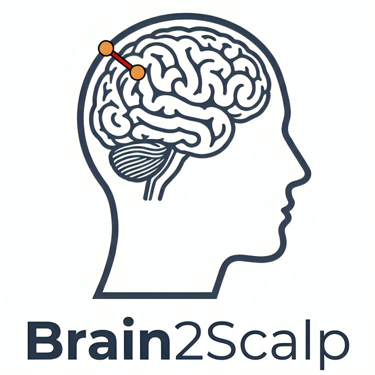
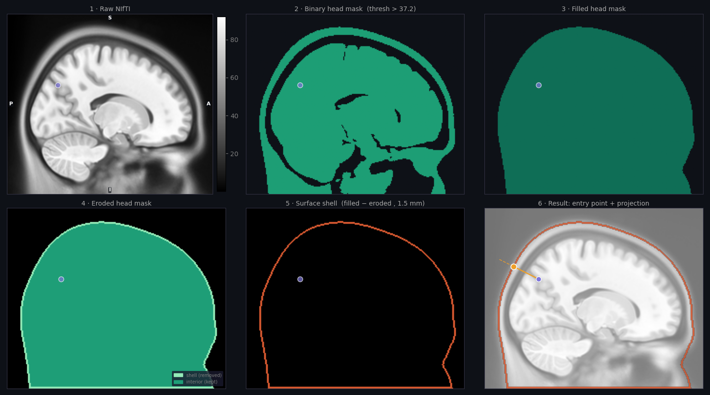
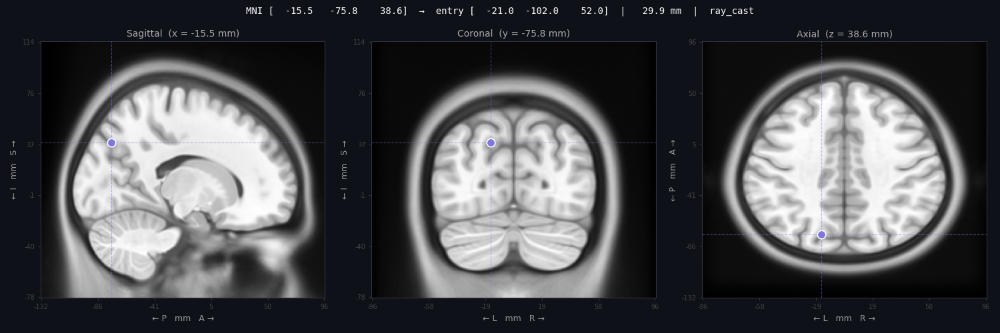
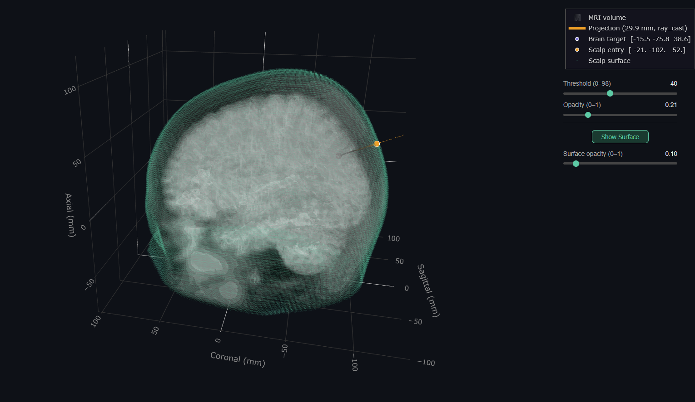

<div align="center">
  <br><br>

  **Map a brain target to its nearest scalp entry point**

  [](#installation)
  [](LICENSE)

</div>

---

## Table of Contents

- [Features](#features)
- [Installation](#installation)
- [Quick Start](#quick-start)
- [Atlas vs Personal Scans](#atlas-vs-personal-scans)
- [CLI Reference](#cli-reference)
- [Python API](#python-api)
- [Output Formats](#output-formats)
- [Visualization](#visualization)
- [Package Layout](#package-layout)
- [License](#license)

---

## Features

- **Local-normal ray-cast** - queries the *k* nearest scalp surface voxels to the brain target, takes their centroid to estimate the local outward normal, then casts a ray along that direction to find the scalp entry point. Falls back to directed nearest-neighbour if the ray misses the surface.
- **MNI and Talairach input** - Talairach auto-converted to MNI152 via Lancaster et al. (2007) piecewise-affine transform, with distinct left/right hemisphere matrices.
- **Multiple targets** - batch coordinate list in one pass.
- **Multi-format output** - plain text table, JSON, or CSV.
- **Optional visualization** - 6-panel pipeline-steps view, 3-panel orthogonal slices, and interactive Plotly 3D viewer.

---

## Installation

### 1. Install Python

Requires **Python >= 3.10**.

**Check if you already have it:**
```bash
python --version
# or
python3 --version
```

If not `Python 3.10.x` or higher, download from https://www.python.org/downloads/ 

---

### 2. Create and activate environment (recommended)

**venv**
```bashSSS
python -m venv env_name

# Activate it
# Windows:
env_name\Scripts\activate
# macOS / Linux:
source env_name/bin/activate
```

**conda**
```bash
conda create -n env_name python=3.10

# Activate it
conda activate env_name
```

---

### 3. Install brain2scalp

**From PyPI** (recommended):

```bash
# Core + CLI (no visualization)
pip install brain2scalp

# With visualization (matplotlib + plotly)
pip install "brain2scalp[viz]"

# Development (adds pytest, ruff, mypy)
pip install "brain2scalp[dev]"
```

**From GitHub**:

You need **Git** installed ([git-scm.com](https://git-scm.com/downloads)). Then:

```bash
git clone https://github.com/LeonardoPoliti/brain2scalp.git
cd brain2scalp

# Core + CLI
pip install .

# With visualization
pip install ".[viz]"
```

**Verify the install:**
```bash
brain2scalp --help
```
You should see the CLI help text.

---

### Requirements

| Dependency | Minimum | Notes |
|---|---|---|
| Python | 3.10 | |
| nibabel | 5.0 | NIfTI I/O |
| numpy | 1.24 | |
| scipy | 1.10 | KD-tree, morphology |
| scikit-image | 0.21 | Convex hull filling |
| matplotlib | 3.7 | `[viz]` only |
| plotly | 5.18 | `[viz]` only |

All dependencies are installed automatically by `pip`.

---

## Quick Start

### Command line examples

```bash
# Single MNI target
brain2scalp --nii mni_icbm152_t1_tal_nlin_sym_09c.nii --target -46 20 32

# Talairach target
brain2scalp --nii mni_icbm152_t1_tal_nlin_sym_09c.nii --target -46 20 32 --space talairach

# Multiple targets on one line
brain2scalp --nii head.nii --target "-46 20 32, 10 -20 45"

# Multiple targets from a CSV file
brain2scalp --nii head.nii --target-file targets.csv

# JSON output to file (format inferred from extension)
brain2scalp --nii head.nii --target -46 20 32 --output result.json

# CSV output to file
brain2scalp --nii head.nii --target -46 20 32 --output result.csv

# 3-panel orthogonal slice view of the target
brain2scalp --nii head.nii --target -46 20 32 --vizTarget

# 6-panel pipeline steps figure
brain2scalp --nii head.nii --target -46 20 32 --vizSteps

# Interactive 3D viewer
brain2scalp --nii head.nii --target -46 20 32 --viz3d

# Save all figures without displaying
brain2scalp --nii head.nii --target -46 20 32 --vizTarget --vizSteps --save-fig ./figs --no-plot
```

### Python API examples

```python
from brain2scalp.core import run, run_full, run_multi, run_full_multi

# Single target - lightweight result (coordinates only)
result = run(
    nii_path="mni_icbm152_t1_tal_nlin_sym_09c.nii",
    brain_target=[-46.0, 20.0, 32.0],
    is_talairach=False,
)

print(result.scalp_entry_mni)    # [x, y, z] in MNI mm
print(result.distance_mm)        # brain-to-scalp distance (mm)
print(result.projection_method)  # 'ray_cast' or 'nearest_neighbor'
print(result.to_dict())          # JSON-serializable dict

# Single target with volumetric arrays (needed for visualization)
state = run_full(
    nii_path="head.nii",
    brain_target=[-46.0, 20.0, 32.0],
    surface_thickness_mm=1.5,
    k_local=100,
    verbose=True,
)

# Multiple targets - one atlas load, one result per target
results = run_multi(
    nii_path="head.nii",
    targets=[[-46.0, 20.0, 32.0], [10.0, -20.0, 45.0]],
)

# Multiple targets with volumetric arrays
states = run_full_multi(
    nii_path="head.nii",
    targets=[[-46.0, 20.0, 32.0], [10.0, -20.0, 45.0]],
    is_talairach=False,
    surface_thickness_mm=1.5,
)
```

---

## Atlas vs Personal Scans

### Using an MNI Atlas

An MNI152 full-head atlas gives a reasonable approximation of scalp topology and is sufficient for group-level studies or when no individual scan is available.

**Example atlas:** `mni_icbm152_t1_tal_nlin_sym_09c.nii`<br>
Download from: https://nist.mni.mcgill.ca/icbm-152-nonlinear-atlases-2009/

**When to use:**
- You have MNI or Talairach coordinates from a literature study or group activation map.
- No individual scan is available.
- You need a quick estimate of scalp position for target planning.

**Limitations:**
- Results reflect average anatomy, not the individual's head shape.
- Accuracy degrades for targets far from group-mean anatomy (e.g. atypical skull shape, lesions).


### Using a Personal Head Scan

**Scan requirements:**
- Must be a **full-head** scan 
- `.nii` or `.nii.gz` format with valid qform/sform header.
- 4D volumes are accepted; only the first frame is used.

**What to avoid:**
- Brain-extracted images (FSL BET output, FreeSurfer `brain.mgz`) - detected and rejected.
- Label/parcellation atlases - also detected and rejected.
- Files with missing or corrupt affine - rejected at load time.

**Option A - Native space**

Use this when your target coordinates come from the same scan.

**Option B - Register to MNI first**

Use this when your target is in MNI space but you want subject-specific scalp topology.
Register the full-head scan to the MNI152 template with a linear (12-DOF) registration, then pass the registered scan with `--space mni`.

> **Note:** Use a full-head MNI template as the registration target to preserve scalp geometry in the output. 

---

## Coordinate Space Summary

| `--space` | Input type | Conversion applied |
|---|---|---|
| `mni` (default) | MNI152 mm coordinates | None |
| `talairach` | Talairach mm coordinates | Lancaster 2007 piecewise-affine → MNI |
| `native` | mm in the scan's own space | None (use with unregistered personal scans) |

---

## CLI Reference

```
brain2scalp --nii PATH --target COORDS [options]
```

### Input

| Flag | Default | Description |
|---|---|---|
| `--nii PATH` | **required** | Full-head `.nii` or `.nii.gz` file |
| `--target COORDS` | **required*** | Target coordinates in mm. Single: `'-46 20 32'`. Multiple (comma-separated): `'-46 20 32, 10 -20 45'` |
| `--target-file PATH` | - | CSV file with one target per row (`x,y,z`). Optional header auto-detected. Combined with `--target`; duplicates silently dropped. |
| `--space {mni,talairach,native}` | `mni` | Coordinate space of the input target |

\* Either `--target` or `--target-file` is required.

### Processing

| Flag | Default | Description |
|---|---|---|
| `--threshold FLOAT` | auto (Otsu) | Override head-mask intensity threshold |
| `--surface-thickness MM` | `1.5` | Surface shell erosion depth in mm |
| `--k-local K` | `100` | k-nearest scalp voxels used to estimate local ray direction |

### Output

| Flag | Default | Description |
|---|---|---|
| `--output PATH` | stdout (text) | Save result to file. Format is inferred from extension: `.txt`, `.json`, or `.csv` |
| `--quiet` | off | Suppress progress messages |

### Visualization (requires `[viz]`)

| Flag | Default | Description |
|---|---|---|
| `--vizSteps [IDX ...]` | off | 6-panel pipeline steps figure. Optionally pass target indices to limit which are shown, e.g. `--vizSteps 0 2` |
| `--step-axis {0,1,2}` | auto | Slice axis for `--vizSteps`: 0=sagittal, 1=coronal, 2=axial |
| `--vizTarget [IDX ...]` | off | 3-panel orthogonal slice view centered on target + entry |
| `--viz3d [IDX ...]` | off | Interactive Plotly 3D viewer |
| `--volume-stride N` | `3` | Subsample every Nth voxel for the 3D point cloud. Lower = denser but slower |
| `--save-fig DIR` | display | Save all figures to this directory (created if missing) |
| `--no-plot` | off | Suppress display. Combine with `--save-fig` to save without showing |

---

## Python API

All functions share the same keyword arguments:

| Parameter | Type | Default | Description |
|---|---|---|---|
| `nii_path` | `str \| Path` | required | Full-head `.nii` or `.nii.gz` |
| `brain_target` / `targets` | `list[float]` / `list[list[float]]` | required | Target(s) in mm |
| `threshold` | `float \| None` | `None` (auto) | Override head-mask threshold |
| `is_talairach` | `bool` | `False` | Convert input from Talairach to MNI |
| `is_native` | `bool` | `False` | Treat target as native scan mm space |
| `surface_thickness_mm` | `float` | `1.5` | Erosion depth for surface shell |
| `k_local` | `int` | `100` | k-nearest scalp voxels for ray direction |
| `verbose` | `bool` | `False` | Print progress to stdout |

### `run()` - single target, lightweight

```python
from brain2scalp.core import run

result = run(
    nii_path="mni_icbm152_t1_tal_nlin_sym_09c.nii",
    brain_target=[-46.0, 20.0, 32.0],
    is_talairach=False,
    verbose=True,
)
```

Returns a `ScalpResult`:

| Attribute | Type | Description |
|---|---|---|
| `brain_target_mni` | `list[float]` | Input target in MNI space |
| `scalp_entry_mni` | `list[float]` | Scalp entry point in MNI space |
| `distance_mm` | `float` | Euclidean distance brain→scalp |
| `projection_method` | `str` | `'ray_cast'` or `'nearest_neighbor'` |
| `coordinate_space` | `str` | `'mni'`, `'talairach'`, or `'native'` |
| `is_talairach` | `bool` | Whether input was Talairach |
| `tal_target` | `list[float] \| None` | Original Talairach coords (if applicable) |
| `nii_path` | `str` | Path to the NIfTI file used |
| `atlas_shape` | `tuple` | NIfTI volume shape |
| `voxel_size_mm` | `tuple` | Voxel dimensions in mm |
| `threshold_used` | `float` | Intensity threshold applied |
| `surface_thickness_mm` | `float` | Erosion depth used |
| `to_dict()` | `dict` | JSON-serializable representation |

### `run_full()` - single target, with volumetric arrays

Same signature as `run()`. Returns a `PipelineState` (extends `ScalpResult`) with additional NumPy arrays for visualization:

| Attribute | Description |
|---|---|
| `data` | Raw NIfTI volume (float64) |
| `affine` | NIfTI affine matrix (4×4) |
| `mask` | Binary head mask (uint8) |
| `filled` | Hole-filled mask (uint8) |
| `eroded` | Eroded mask (uint8) |
| `surface` | Surface shell: filled XOR eroded (uint8) |
| `scalp_surface_mni` | (N, 3) float64 — all surface voxel centers in MNI mm |

### `run_multi()` / `run_full_multi()` - multiple targets

```python
from brain2scalp.core import run_multi, run_full_multi

# Lightweight - one atlas load, one ScalpResult per target
results = run_multi(
    nii_path="head.nii",
    targets=[[-46.0, 20.0, 32.0], [10.0, -20.0, 45.0]],
)

# With arrays - returns list[PipelineState]
states = run_full_multi(
    nii_path="head.nii",
    targets=[[-46.0, 20.0, 32.0], [10.0, -20.0, 45.0]],
    is_talairach=False,
    surface_thickness_mm=1.5,
)
```
---

## Output Formats

Output format is determined by the file extension passed to `--output`. Without `--output`, results are printed as text to stdout.

### Text (`.txt`)

When Talairach input is used, `tal_x/y/z` columns are added automatically.

```
  target  mni_x   mni_y   mni_z   entry_x  entry_y  entry_z  dist_mm
       0  -46.0    20.0    32.0    -62.3     35.7     47.5     32.5
       1   10.0   -20.0    45.0     14.8    -28.1     58.3     19.2
```

### JSON (`.json`)

A single result is returned as an object; multiple results as an array.
When Talairach input is used, a `tal_original` field is added.

```json
{
  "target": 0,
  "mni":  { "x": -46.0, "y": 20.0,  "z": 32.0 },
  "entry": { "x": -62.3, "y": 35.7,  "z": 47.5 },
  "distance_mm": 32.5
}
```

### CSV (`.csv`)

Same columns as text. `tal_x/y/z` columns included when Talairach input was used.

```csv
target,mni_x,mni_y,mni_z,entry_x,entry_y,entry_z,dist_mm
0,-46.0,20.0,32.0,-62.3,35.7,47.5,32.5
```

### Target file format (`--target-file`)

Plain CSV, one target per row. Header row is auto-detected and skipped.

```csv
x,y,z
-46,20,32
10,-20,45
```

---

## Visualization

> Requires `pip install "brain2scalp[viz]"`.

### Pipeline steps (`--vizSteps`)

6-panel figure showing each stage of the head-mask pipeline: raw data → binary mask → hole-filled → eroded → surface shell → overlay with target and entry point.



---

### Orthogonal slice view (`--vizTarget`)

3-panel sagittal / coronal / axial slices centered on the brain target, with the projected scalp entry point overlaid.



---

### Interactive 3D viewer (`--viz3d`)

Plotly HTML viewer with isosurface rendering of the head, scalp surface point cloud, and brain target / scalp entry markers. Includes threshold and opacity sliders. Supports up to 8 targets. Stride (settable via `--stride`) controls voxel subsampling for the isosurface: lower values give finer geometry but increase file size and browser render time; higher values are faster and lighter.



---

## Package Layout

```
brain2scalp/
├── brain2scalp/
│   ├── core/
│   │   ├── models.py        ScalpResult, PipelineState
│   │   ├── transform.py     Talairach ↔ MNI (Lancaster 2007)
│   │   ├── atlas.py         Load, reorient, validate NIfTI
│   │   ├── mask.py          Threshold → fill → erode → surface
│   │   ├── projection.py    Ray-cast + nearest-neighbour fallback
│   │   └── pipeline.py      run() / run_full() / run_multi() / run_full_multi()
│   ├── cli/
│   │   ├── main.py          argparse entry point
│   │   └── formatters.py    text / JSON / CSV output
│   └── viz/
│       ├── slice2d_view.py  Pipeline steps + orthogonal slice figures
│       └── view_3d.py       Plotly interactive 3D viewer
├── tests/
│   ├── test_transform.py
│   ├── test_mask.py
│   ├── test_projection.py
│   ├── test_pipeline.py
│   ├── test_cli_helpers.py
│   └── test_formatters.py
└── assets/
    └── b2s_logo.png
```

---

> [!WARNING]
> **Research use only.** This tool has not been validated for clinical use and must not be used to guide patient treatment, clinical diagnosis or medical decision-making. For any clinical application, always rely on a qualified clinician and a certified neuronavigation system.

---

## License

MIT — see [LICENSE](LICENSE).

Copyright 2026 Leonardo Politi.
